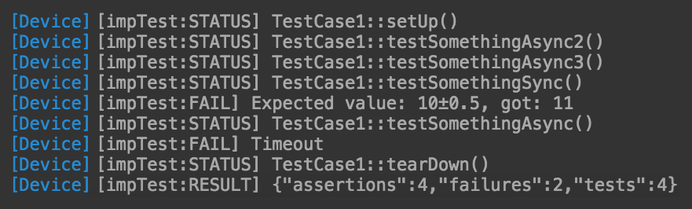

<!-- START doctoc generated TOC please keep comment here to allow auto update -->
<!-- DON'T EDIT THIS SECTION, INSTEAD RE-RUN doctoc TO UPDATE -->


- [impTest – Electric Imp Test Runner](#imptest-%E2%80%93-electric-imp-test-runner)
  - [Requirements](#requirements)
  - [Installation](#installation)
  - [imptest commands](#imptest-commands)
    - [init](#init)
    - [test](#test)
  - [Writing tests](#writing-tests)
    - [Test case lifecycle: setUp() and tearDown() methods](#test-case-lifecycle-setup-and-teardown-methods)
    - [Asynchronous methods](#asynchronous-methods)
    - [Assertions](#assertions)
    - [Async tests timeout](#async-tests-timeout)
    - [Running the tests manually](#running-the-tests-manually)
    - [Sample output](#sample-output)
  - [.imptest file specification](#imptest-file-specification)
  - [Development](#development)
    - [Installation](#installation-1)
    - [Testing](#testing)

<!-- END doctoc generated TOC please keep comment here to allow auto update -->

# impTest – Electric Imp Test Runner

## Requirements

|Dependency|OS X Installation|
|:--|:--|
|Node.js 5.1+|`brew install nodejs`|

## Installation

_(not published yet)_

`npm install -g imptest`

## imptest commands

### init

```
imptest init [options]

Options:

  -d, --debug          debug output
  -c, --config [path]  config file path [default: .imptest]
  -f, --force          overwrite existing configuration
```

### test

```
imptest test [options]

Options:

  -d, --debug          debug output
  -c, --config [path]  config file path [default: .imptest]
  -a, --agent [bool]   push agent code [default: true]
  -i, --imp [bool]     push device code [default: true]
```

## Writing tests

impTest looks for classes inherited from the  `ImpTestCase` class and treats them as a test cases.
Methods named as __test...__ are considered as test methods.

Here is a sample test case:

```squirrel
class TestCase1 extends ImpTestCase {

  /**
   * (optional) Async version, can also be synchronous
   */
  function setUp() {
    return Promise(function (resolve, reject){
      resolve("we're ready");
    }.bindenv(this));
  }

  /**
   * Sync test method
   */
  function testSomethingSync() {
     this.assertTrue(true); // ok
     this.assertTrue(false); // fails
  }

  /**
   * Async test method
   */
  function testSomethingAsync() {
    return Promise(function (resolve, reject){

      // return in 2 seconds
      imp.wakeup(2 /* 2 seconds */, function () {
        resolve("something useful");
      }.bindenv(this));

    }.bindenv(this));
  }

  /**
   * (optional) Teardown method - cleans up after the test
   */
  function tearDown() {
  }

}
```

### Test case lifecycle: setUp() and tearDown() methods

Each test case has __setUp()__ and __tearDown()__ methods for instantiating the environment and cleaning-up afterwards.

### Asynchronous methods

Every test method (__setUp()__ and __tearDown()__ included) can either be synchronous or asynchronous.
In order for method to be asynchronous it should return an instance of __Promise__, like that:

```squirrel
function testSomethingAsyncronously() {
  return Promise(function (resolve, reject){
    resolve("we're done");
  });
}
```

### Assertions

Currently the following assertions are available:

* this.assertTrue(value, [message]);
* this.assertEqual(expected, actual, [message]);
* this.assertClose(expected, actual, maxDifference, [message]);

### Async tests timeout

__asyncTimeout__ parameter on ImpTestRunner class sets the timeout after which the async test will fail.

### Running the tests manually

Tests can be executed manually with human-readable output with

```squirrel
testRunner <- ImpTestRunner();
testRunner.asyncTimeout = 1 /* [seconds] */;
testRunner.readableOutput = true;
testRunner.stopOnFailure = true;
testRunner.run();
```

### Sample output

(in human readable mode)



## .imptest file specification

__.imptest__ file is used to deploy tests to a certain device/model.

```js
{
    "apiKey":         {string},           // Build API key
    "modelId":        {string},           // Model id
    "devices":        {string[]},         // Device IDs
    "deviceFile":     {string},           // Device code file. Default: "device.nut"
    "agentFile":      {string},           // Agent code file. Default: "agent.nut"
    "tests":          {string|string[]},  // Test file search pattern. Default: ["*.test.nut", "tests/**/*.test.nut"]
    "stopOnFailure":  {boolean},          // Stop tests execution on failure? Default: false
    "timeout":        {number}            // Async test methods timeout, seconds. Default: 10
}
```

## Development

### Installation

```bash
git clone <repo-url-goes-here> imptest
cd imptest
npm i
```

### Testing

Copy __spec/config.js.dist__ to __config.js__ and fill-in the neccesary settings, then:

```bash
SPEC_DEBUG=<true|false> npm test
```
