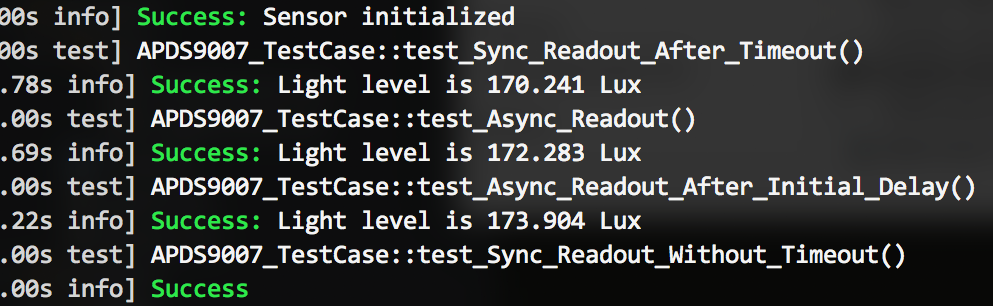
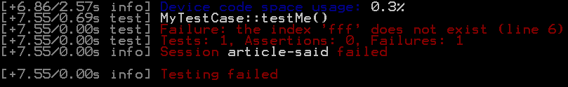
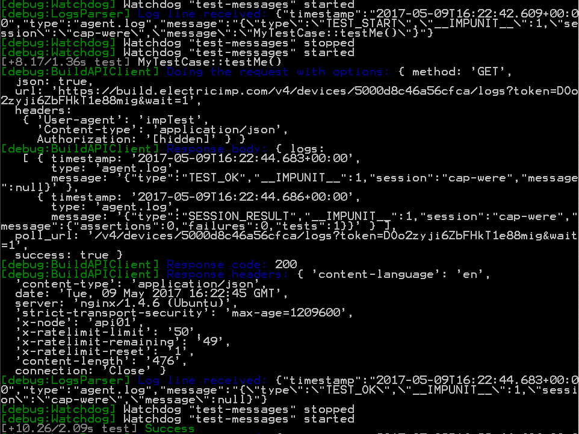

# impTest

**impTest** is a set of tools to run unit tests built with 
[impUnit](https://github.com/electricimp/impUnit) test framework. **impTest** leverages
[Electric Imp Build API](https://electricimp.com/docs/buildapi/) to deploy and run the code
on imp devices. All tools are written in [Node.js](https://nodejs.org/en/) and fully 
available in sources.

**impTest** looks for classes inherited from the `ImpTestCase` and treats them as **test cases**.
Methods named as _test..._ are considered to be the test methods, or, simply _tests_.

- [Installation](#installation)
- [Test Project Configuration](#test-project-configuration)
  - [New Project Configuration](#new-project-configuration)
  - [Sample Test Generation](#sample-test-generation)
  - [GitHub Credentials Configuration](#github-credentials-configuration)
  - [Environment Variables Settings](#environment-variables-settings)
- [Writing Tests](#writing-tests)
  - [Agent Code And Device Code Together](#agent-code-and-device-code-together)
  - [**Test Case** Lifecycle: setUp() and tearDown()](#test-case-lifecycle-setup-and-teardown)
  - [Asynchronous Testing](#asynchronous-testing)
  - [**Builder** Language](#builder-language)
    - [Include From GitHub](#include-from-github)
  - [External Commands](#external-commands)
  - [Assertions](#assertions)
    - [assertTrue()](#asserttrue)
    - [assertEqual()](#assertequal)
    - [assertGreater()](#assertgreater)
    - [assertLess()](#assertless)
    - [assertClose()](#assertclose)
    - [assertDeepEqual()](#assertdeepequal)
    - [assertBetween()](#assertbetween)
    - [assertThrowsError](#assertthrowserror)
  - [Diagnostic Messages](#diagnostic-messages)
  - [**Test Case** Example](#test-case-example)
- [Running Tests](#running-tests)
  - [Selective Test Runs](#selective-test-runs)
  - [Debug Mode](#debug-mode)
- [For **impTest** Developers](#for-imptest-developers)
- [License](#license)

## Installation

[Node.js 4.0+](https://nodejs.org/en/) is required. 
You can download the Node.js [pre-built binary](https://nodejs.org/en/download/) for your platform or install Node.js via [package manager](https://nodejs.org/en/download/package-manager).
Once `node` and `npm` are installed, to setup **impTest** please execute the command

`npm i -g imptest`


## Test Project Configuration

Configuration file is JSON file that contains settings for tests execution.
The directory in which configuration file is located is treated as **Project Home**.
**impTest** starts to search test files from the **Project Home**.
Configuration file contains following keys:

| Key | Description |
| --- | --- |
| __apiKey__ | [Build API key](https://electricimp.com/docs/ideuserguide/account) provides access to [Electric Imp Build API](https://electricimp.com/docs/buildapi/). For security reason We strongly recommended to define Build API key as [environment variables](#environment-variables-settings). |
| __devices__ | It is the set of Device IDs that will be used for test execution. |
| __modelId__ | Id of model that is attached to devices. |
| __deviceFile__ | This is the path to the device additional code file. This code will be deployed on imp device as part of test. `false` is used if no additional code. |
| __agentFile__ | This is the path to the agent additional code file. This code will be deployed on server as part of test. `false` is used if no additional code. |
| __tests__ | This is a pattern that **impTest** uses to search Test files. If `**` is alone in a path portion, then it matches zero or more directories and subdirectories searching for matches. It does not crawl symlinked directories. The pattern default value is `["*.test.nut", "tests/**/*.test.nut"]`. |
| __stopOnFailure__ | Set this option to `true` if you want to stop execution after test failing. The default value is `false`. |
| __timeout__ | Parameter sets the timeout after which the tests will fail. Async tests will be interrupted. |

Format of configuration file is:

```js
{
    "apiKey":         {string},           // Build API key, optional
    "modelId":        {string},           // Model id
    "devices":        {string[]},         // Device IDs
    "deviceFile":     {string|false},     // Device code file. Default: "device.nut"
    "agentFile":      {string|false},     // Agent code file. Default: "agent.nut"
    "tests":          {string|string[]},  // Test file search pattern. Default: ["*.test.nut", "tests/**/*.test.nut"]
    "stopOnFailure":  {boolean},          // Stop tests execution on failure? Default: false
    "timeout":        {number}            // Async test methods timeout, seconds. Default: 10
}
```

### New Project Configuration

Configuration file can be generated with command:

`imptest init [-c <configuration_file>] [-d] [-f]`

where:

* `-d` &mdash; print debug output
* `-c` &mdash; this option is used to provide path to configuration file. `.imptest` file in current directory will be used if `-c` is not defined. Relative or absolute path may be used. Generation will fail if any intermediate directory in the path does not exist.
* `-f` &mdash; to update (overwrite) an existing configuration

You will be asked for [configuration properties](#test-project-configuration) during the generation.

### Sample Test Generation

The command `imptest init` can generate sample [**test cases**](#writing-tests).
`tests/agent.test.nut` file will be generated if __agentFile__ is defined.
`tests/device.test.nut` file will be generated if __deviceFile__ is defined.

Example of console log:
```
> Write to .imptest?: (yes)
Config file saved
> Generate sample test cases?: (yes)
Created file "tests/agent.test.nut"
Created file "tests/device.test.nut"
```

### GitHub Credentials Configuration

GitHub credentials may be required to include external sources [from GitHub](#include-from-github).
The command `imptest github` can generate or update credentials in file. For example:

`imptest github [-c <configuration_file>] [-d] [-f]`

where:

* `-d` &mdash; print debug output
* `-c` &mdash; this option is used to provide path to file with GitHub credentials. `.imptest-auth` file in current directory will be used if `-c` is not defined. Relative or absolute path may be used. Generation will fail if any intermediate directory in the path does not exist.
* `-f` &mdash; to update (overwrite) an existing configuration

The file syntax is:

```
{
    "github-user": "user",
    "github-token": "password_or_token"
}
```

### Environment Variables Settings

Environment variables are used in place of missing keys:
- **apiKey** – `IMP_BUILD_API_KEY` is used in [Electric Imp Build API](https://electricimp.com/docs/buildapi/) to deploy and run the code on imp devices.
- **github-user** – `GITHUB_USER` is used to include external sources [from GitHub](#include-from-github).
- **github-token** – `GITHUB_TOKEN` is used to include external sources [from GitHub](#include-from-github).

## Writing Tests

Initially **impTest** looks for files with names that are matched with [pattern](#test-project-configuration).
File searching starts from the [**Project Home**](#test-project-configuration).
After that **impTest** collects classes inherited from the `ImpTestCase` in test file and treats them as **test cases**.
Methods named as _test..._ are considered to be the _tests_.

The simplest **test case** looks like:

```squirrel
class MyTestCase extends ImpTestCase {
  function testSomething() {
    this.assertTrue(true);
  }
}
```

### Agent Code And Device Code Together

It is possible to use agent and device specific test code together. The rules for the using are:
- [**Test cases**](#writing-tests) should be either in device code nor agent code, not in both. Let's name the file with test's implementation as *TestFile*, another file will have name - *PartnerFile*
- *TestFile* and *PartnerFile* names should conform the pattern ```[TestName].[agent | device].test.nut```.
- *TestFile* and *PartnerFile* should be in the same folder(directory).
- *TestFile* **should** be match to ["Test file search pattern"](#test-project-configuration)
- *PartnerFile* **should not** be match to ["Test file search pattern"](#test-project-configuration). Otherwise the *PartnerFile* will be in `TestFile` role and the *TestFile* becomes to be in `PartnerFile` role. **impTest** doesn't add `ImpTestCase` class to the partner code. As a result an execution will fail.

An example of agent and device using can be found in [sample7](./samples/sample7).

### **Test Case** Lifecycle: setUp() and tearDown()

Each [**test case**](#writing-tests) can have `setUp()` and `tearDown()` methods for instantiating the environment and cleaning-up afterwards.

### Asynchronous Testing

Every test method (as well as `setUp()` and `tearDown()`) can either be synchronous or asynchronous.

Method should return the instance of [**Promise**](https://github.com/electricimp/Promise) to notify that it needs to do some work asynchronously.

The resolution means test all test were successful, rejection denotes a failure.

Example:

```squirrel
function testSomethingAsyncronously() {
  return Promise(function (resolve, reject){
    resolve("It's all good, man!");
  });
}
```

### **Builder** Language

[**Builder**](https://github.com/electricimp/Builder) is supported by **impTest**.
**Builder** language combines a preprocessor with an expression language and advanced imports. Example:

```squirrel
@set assertText = "Failed to assert that values are"

this.assertEqual(
  expected,
  actual,
    "@{assertText}"
    + " equal in '@{__FILE__}'"
    + " at line @{__LINE__}"
);
```

[*\_\_FILE\_\_* and *\_\_LINE\_\_*](https://github.com/electricimp/Builder#variables) variables are defined in the [**Builder**](https://github.com/electricimp/Builder), 
which may be useful for debugging information. Here is the usage example:

```squirrel
this.assertEqual(
  expected,
  actual,
  "Failed to assert that values are"
    + " equal in '@{__FILE__}'"
    + " at line @{__LINE__}"
);
```

#### Include From GitHub

Sources [from GitHub](https://github.com/electricimp/Builder#from-github) can be included to test files.
It may required to have credentials to obtain an access to GitHub. There are two ways to provide GitHub credentials:
- The first way is to use an [Environment Variables](#environment-variables-settings).
- The second way is to provide [GitHub credentials file](#github-credentials-configuration).

### External Commands

External commands can be triggered by [**test case**](#writing-tests) like so:

```squirrel
// within the test case/method
this.runCommand("echo 123");
```

The command `echo 123` will be executed by **impTest**.

If external command execution times out (the time it's given is controlled by the _timeout_ parameter in [test configuration](#test-project-configuration)) or exits with status code other than 0, the test session fails.

### Assertions

The following assertions are available in [**test cases**](#writing-tests).

#### assertTrue()

`this.assertTrue(condition, [message])`

Asserts that the condition is truthful.

Example:

```squirrel
 // ok
this.assertTrue(1 == 1);

// fails
this.assertTrue(1 == 2);
```

#### assertEqual()

`this.assertEqual(expected, actual, [message])`

Asserts that two values are equal

Example:

```squirrel
// ok
this.assertEqual(1000 * 0.01, 100 * 0.1);

// Failure: Expected value: 1, got: 2
this.assertEqual(1, 2);
```

#### assertGreater()

`this.assertGreater(actual, cmp, [message])`

Asserts that value is greater than some other value.

Example:

```squirrel
// ok
this.assertGreater(1, 0);

// Failure: Failed to assert that 1 > 2
this.assertGreater(1, 2);
```

#### assertLess()

`this.assertLess(actual, cmp, [message])`

Asserts that value is less than some other value.

Example:

```squirrel
// ok
this.assertLess(0, 1);

// Failure: Failed to assert that 2 < 2
this.assertLess(2, 2);
```

#### assertClose()

`this.assertClose(expected, actual, maxDiff, [message])`

Asserts that value is within some tolerance from expected value.

Example:

```squirrel
// ok
this.assertClose(10, 9, 2);

// Failure: Expected value: 10пїЅ0.5, got: 9
this.assertClose(10, 9, 0.5);
```

#### assertDeepEqual()

`this.assertDeepEqual(expected, actual, [message])`

Performs a deep comparison of tables, arrays and classes.

Example:

```squirrel
// ok
this.assertDeepEqual({"a" : { "b" : 1 }}, {"a" : { "b" : 0 }});

// Failure: Missing slot [a.b] in actual value
this.assertDeepEqual({"a" : { "b" : 1 }}, {"a" : { "_b" : 0 }});

// Failure: Extra slot [a.c] in actual value
this.assertDeepEqual({"a" : { "b" : 1 }}, {"a" : { "b" : 1, "c": 2 }});

// Failure: At [a.b]: expected "1", got "0"
this.assertDeepEqual({"a" : { "b" : 1 }}, {"a" : { "b" : 0 }});
```

#### assertBetween()

`this.assertBetween(actual, from, to, [message])`

Asserts that a value belongs to the range from _from_ to _to_.

Example:

```squirrel
// ok
this.assertBetween(10, 9, 11);

// Failure: Expected value in the range of 11..12, got 10
this.assertBetween(10, 11, 12);
```

#### assertThrowsError

`this.assertThrowsError(func, ctx, [args = []], [message])`

Asserts that function _func_ throws an error when called with arguments _args_ and context _ctx_. Returns error thrown by _func_.

```squirrel
// ok, returns "abc"
this.assertThrowsError(function (a) {
  throw a;
}, this, ["abc"]);

// Failure: Function was expected to throw an error
this.assertThrowsError(function () {
  // throw "error";
}, this);
```

### Diagnostic Messages

Return values (other than *null*) are displayed in the console when test succeeds and can be used to output diagnostic messages, like:



[**Test cases**](#writing-tests) can also output informational messages with:

```squirrel
this.info(<message>)
```

Log of failed test looks like:



This means that execution of `testMe` method in the `MyTestCase` class has been failed:
Incorrect syntax is in line 6 in test file (in which `MyTestCase` class).

### [**Test Case**](#writing-tests) Example

utility file `myFile.nut` code is:
```squirrel

  // (optional) Async version, can also be synchronous

  function setUp() {
    return Promise(function (resolve, reject){
      resolve("we're ready");
    }.bindenv(this));
  }
```

[**test case**](#writing-tests) code is:
```squirrel
class TestCase1 extends ImpTestCase {

@include __PATH__+"/myFile.nut"

  // Sync test method

  function testSomethingSync() {
     this.assertTrue(true); // ok
     this.assertTrue(false); // fails
  }


  // Async test method

  function testSomethingAsync() {
    return Promise(function (resolve, reject){

      // return in 2 seconds
      imp.wakeup(2 /* 2 seconds */, function () {
        resolve("something useful");
      }.bindenv(this));

    }.bindenv(this));
  }

  // (optional) Teardown method - cleans up after the test

  function tearDown() {
  }

}
```

## Running Tests

To run tests `imptest test` command is used.

imptest test [-c <configuration_file>] [-g <credentials_file>] [-d] [testcase_pattern]`

where:

* `-c` &mdash; path to configuration file. Relative or absolute path may be used. `.imptest` file in current directory will be used if `-c` is not defined.
* `-g` &mdash; path to github credentials configuration file. Relative or absolute path may be used. `.imptest-auth` file in current directory will be used if `-g` is not defined.
* `-d` &mdash; print [debug output](#debug-mode), store device and agent code
* `testcase_pattern` &mdash; pattern for [selective test runs](#selective-test-runs)

### Selective Test Runs

[`testcase_pattern`](#running-tests) allows to execute single [_test_](#Writing-Tests) in [**test case**](#writing-tests).
The syntax is: `[testClass].[testMethod]`

where:

* `testClass` &mdash; name of the [**test case**]((#writing-tests)) (test class)
* `testMethod` &mdash; test method name in a [**test case**](#writing-tests).

Using of `testcase_pattern`:

Let test file be:
```
class MyTestClass extends ImpTestCase {
    function testMe() {...}
    function testMe_1() {...}
}
class MyTestClass_1 extends ImpTestCase {
    function testMe() {...}
    function testMe_1() {...}
}
```

- `imptest test MyTestClass.testMe` runs `testMe()` method in `MyTestClass` class
- `imptest test MyTestClass_1.` runs all test methods from `MyTestClass_1` class
- `imptest test .testMe_1` runs `testMe_1()` methods in the both classes
- `imptest test .` is the same as `imptest test`, which makes all test method in all the found test classes to be run

### Debug Mode

`-d` option is used to run tests in debug mode:
- debug output will be switched on. JSON is used to communicate between [impUnit](https://github.com/electricimp/impUnit) test framework and **impTest**. The communication messages will be printed.
- device and agent code will be stored in `./build` folder that will be created in [**Project Home**](#test-project-configuration)

Debug mode is useful for failures analyzing.

Example of debug log:



## [For **impTest** Developers](./docs/forImptestDevelopers.md)

## License

The code in this repository is licensed under [MIT License](./LICENSE).
